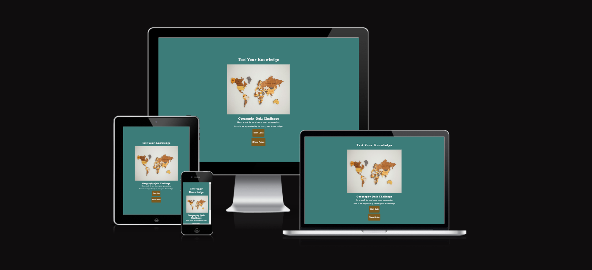

# [TEST YOUR KNOWLEDGE](https://jojoakh.github.io/Test-your-knowledge/)

## A Geography Quiz Website

> Test Your Knowledge is a quiz game with geography questions. The user is presented with six questions to answer.

>The user has the option to read the rules of the game to better understand the format of the quiz before clicking start quiz.

> The quiz consist of random questions for all over the world. At the end the of the game, the user must enter a username to view the final scores. 

## UX

### Color Scheme

- `#3c7c79`   used primarily for the background colour through out the page.
- `#934e00be` used as the background color for the buttons.
- `#132827`   used for the rules container.
- `#460111`   used for timer.
- `#f5f5f5`   used for primary text.

I used [coolers](https://coolors.co/f5f5f5-460111-3c7c79-934e00-132827) generate my color palette.

### Image

The image used for this project is a picture of a map, just to show the users the area the site is focused on.

## Wireframes

## Features

- **Welcome Image**

- **Game Area**    
    - This area shows the start button and the rules button.

- **Rules Box**

- **Quiz Dashboard**
    - When the start quiz button is clicked the quiz begins with a question and four options to pick from.

- **Timer Countdown**
    - When the countdown time runs out without user clicking any option, time is up message pops up and the correct is revealed.

- ***Correct Answer***    
    - When the correct answer is clicked, the button's background color changes to green, to indicate to the user that the answer is correct.

- ***Wrong Answer***
    - When the answer is incorrect, the selected button's background color changes to red to indicate a wrong answer to the user. and correct answer is highlighted with green color.

- **End Quiz section**

- ***Username***
    - At the end of the game the user enters a username before final score is displayed.

- ***Final scores and feeadback***
    - After the user enters a username and submit, the user's name, final score and feedback is displayed.

    

