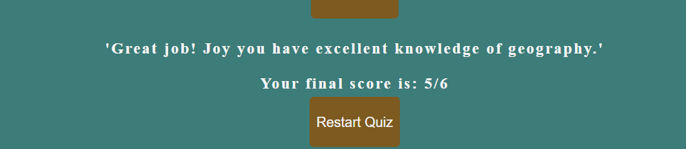
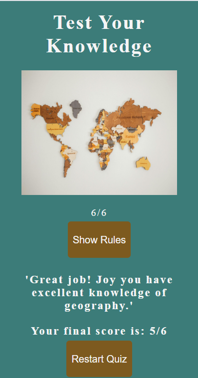

# [TEST YOUR KNOWLEDGE](https://jojoakh.github.io/Test-your-knowledge/)

## A Geography Quiz Website

> Test Your Knowledge is a quiz game with geography questions. The user is presented with six questions to answer.

>The user has the option to read the rules of the game to better understand the format of the quiz before clicking start quiz.

> The quiz consist of random questions for all over the world. At the end the of the game, the user must enter a username to view the final scores. 

## UX

### Color Scheme

- `#3c7c79`   used primarily for the background colour through out the page.
- `#934e00be` used as the background color for the buttons.
- `#132827`   used for the rules container.
- `#460111`   used for timer.
- `#f5f5f5`   used for primary text.

I used [coolers](https://coolors.co/f5f5f5-460111-3c7c79-934e00-132827) generate my color palette.

### Image

The image used for this project is a picture of a map, just to show the users the area the site is focused on.

## Wireframes

## Features

- **Welcome Image**

- **Game Area**    
    - This area shows the start button and the rules button.

- **Rules Box**

- **Quiz Dashboard**
    - When the start quiz button is clicked the quiz begins with a question and four options to pick from.

- **Timer Countdown**
    - When the countdown time runs out without user clicking any option, time is up message pops up and the correct is revealed.

- ***Correct Answer***    
    - When the correct answer is clicked, the button's background color changes to green, to indicate to the user that the answer is correct.

- ***Wrong Answer***
    - When the answer is incorrect, the selected button's background color changes to red to indicate a wrong answer to the user. and correct answer is highlighted with green color.

- **End Quiz section**

- ***Username***
    - At the end of the game the user enters a username before final score is displayed.

- ***Final scores and feeadback***
    - After the user enters a username and submit, the user's name, final score and feedback is displayed.

### Future Features

-  Allow questions with images as answer choices alongside text options. 
- Include open-ended questions where users can type in their answers.

## Tools & Technologies Used

-  used for version control. (`git add`, `git commit`, `git push`)
-  used for secure online code storage.
-  used as a cloud-based IDE for development.
-  used for the main site content.
-  used for the main site design and layout.
-  used for hosting the deployed front-end site.
-  used to make the site interactive.
-  used to generate README/TESTING templates.
-  used to create wireframes in early development.

## Testing

#### Manual Testing

| Test | Result |
|--|--|
|When start quiz is clicked, it initiates the quiz by shuffling questions, resetting variables, hiding the start section, and showing the first question.| Pass |
|Questions display randomly|Pass|
|When the rules button is clicked the rules pops up|Pass|
|The rules button closes when user clicks the close button|Pass|
|When quiz starts the countdown begins |Pass|
|When user selects answer, new question and answers are pulled|Pass|
|When new question is clicked the time count restarts|Pass|
|When the correct answer is clicked the button background color changes to green|Pass|
|When the wrong answer is clicked the button background color changes to red|Pass|
|Username section appears after the quiz to prompt users to enter a username for the final score display|Pass|
|Final score container shows the username, score, restart button, and optional feedback message|Pass|
|When the user clicks restart quiz the page reloads back to the start|Pass|

## Code Validation

### HTML

I have used the recommended [HTML W3C Validator](https://validator.w3.org) to validate all of my HTML files.

| Page | screenshot | Notes |
| --- | --- | --- |
| Home |  | Pass: No Errors |

### CSS

I have used the recommended [CSS Jigsaw Validator](https://jigsaw.w3.org/css-validator) to validate all of my CSS files.

| File | Screenshot | Notes |
| --- | --- | --- | 
| style.css |  | Pass: No Errors |

### JavaScript

I have used the recommended [JShint Validator](https://jshint.com) to validate all of my JS files.

| File | Screenshot | Notes |
| --- | --- | --- |
| script.js |  | Pass: No Warnings |

### Lighthouse Audit

| Page | Mobile | Desktop | Notes |
| --- | --- | --- | --- |
| Home |  |  | Minor Warnings |

## Browser Compatibility

I've tested my deployed project on multiple browsers to check for compatibility issues.

| Browser | Home | Game Area | Notes |
| --- | --- | --- | --- | 
| Chrome |  |  | Works as expected |
| Opera |  |  | Works as expected |
| Edge |  |   | Works as expected |

## Responsiveness

I've tested my deployed project for responsiveness issues.

| Device | Home | Game Area | Username | Scores | Notes |
| --- | --- | --- | --- | --- | --- |
| Mobile (DevTools) |  |  |  |  | Works as expected |
| Tablet (DevTools) |  |  |  |  | Works as expected |
| Desktop |  |  |  |  | Works as expected |

## Bugs

## Deployment

The site was deployed to GitHub Pages. The steps to deploy are as follows:

- In the [GitHub repository](https://github.com/jojoakh/Test-your-knowledge.git), navigate to the Settings tab 
- From the source section drop-down menu, select the **Main** Branch, then click "Save".
- The page will be automatically refreshed with a detailed ribbon display to indicate the successful deployment.
 
 [Live link](https://jojoakh.github.io/Test-your-knowledge/)

### Local Deployment

This project can be cloned or forked in order to make a local copy on your own system.

#### Cloning

You can clone the repository by following these steps:

1. Go to the [GitHub repository](https://github.com/jojoakh/Test-your-knowledge.git) 
2. Locate the Code button above the list of files and click it 
3. Select if you prefer to clone using HTTPS, SSH, or GitHub CLI and click the copy button to copy the URL to your clipboard
4. Open Git Bash or Terminal
5. Change the current working directory to the one where you want the cloned directory
6. In your IDE Terminal, type the following command to clone my repository:
	- `git clone https://github.com/jojoakh/Test-your-knowledge.git`
7. Press Enter to create your local clone.

#### Forking

By forking the GitHub Repository, we make a copy of the original repository on our GitHub account to view and/or make changes without affecting the original owner's repository.
You can fork this repository by using the following steps:

1. Log in to GitHub and locate the [GitHub Repository](https://github.com/jojoakh/Test-your-knowledge.git)
2. At the top of the Repository (not top of page) just above the "Settings" Button on the menu, locate the "Fork" Button.
3. Once clicked, you should now have a copy of the original repository in your own GitHub account!

    

